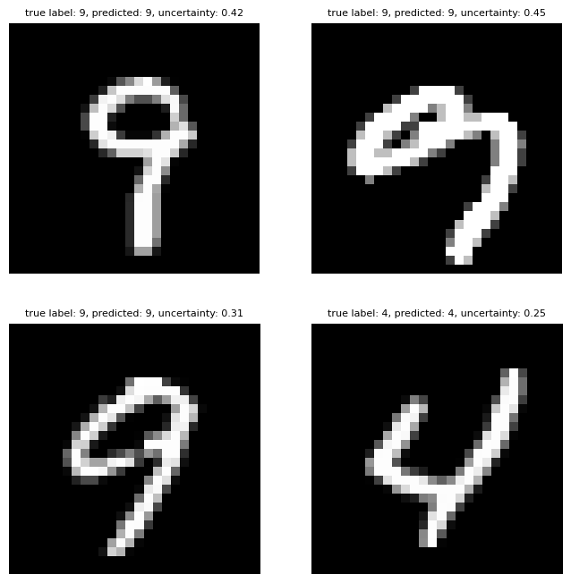
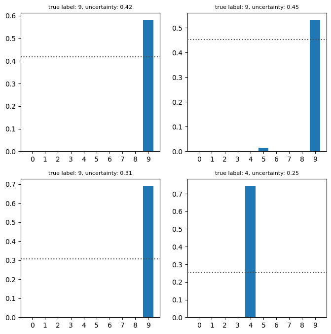

# Evidential deep learning

This repo implements [Evidential Deep Learning to Quantify Classification Uncertainty](https://arxiv.org/abs/1806.01768). The paper proposes a method to quantify uncertainty in a neural network by parametrizing the class probabilities with a Dirichlet distribution whose parameters are outputs of the neural network.

Under the Subjective Logic framework, belief mass assignments represent the belief that the truth can be on a given state (or a class in this setting) and it also provides an overall uncertainty quantity such that $` u + \sum_{K} b_k = 1 `$, for K possible states (or classes).

Belief masses are calculated from evidences: $` b_k = \frac{e_k}{S} `$ where $` S = \sum_{K} (e_k + 1) `$ and the overall uncertainty is defined $` \frac{K}{S} `$. Those belief mass assignments correspond to a Dirichlet distribution with parameters $` \alpha_{k} = evidence_k + 1 `$, and this distribution is used as a prior over the class probabilities. The expected probability of a class k is the mean of the Dirichlet distribution: $` P_k = \frac{\alpha_{k}}{ \sum_{K} \alpha_{i} } `$

The paper proposes to parametrize the Dirichlet distribution describing the beliefs with a neural network that outputs a positive vector of evidences for each classes instead of outputting logits or class probabilities like in the regular classification setting. The model is trained using different possible losses that they describe in the paper.

### Example on MNIST

Using a simple convolutional neural network predicting evidences, we can extract the class probabilities, beliefs and total uncertainty. 2nd sample from the top-left is interesting as we see that the model assigned some belief to the class 5 on this wiggly 9 but it still managed to correctly guess the class.

| Images with predictions                                     | Corresponding beliefs and uncertainty                        |
| ----------------------------------------------------------- | ------------------------------------------------------------ |
|  |  |

## Dependencies

The repository has the following dependencies:

- python 3.9+
- pytorch 2+

## Getting Started

```
git clone https://github.com/clabrugere/evidential-deeplearning.git
```

## Usage

See the example notebook.

```python
# load your dataset
train_dataloader = ...
test_dataloader = ...
device = ...

# encoder can by arbitrary, for example a simple convnet here
encoder = nn.Sequential(
    nn.Conv2d(1, 20, 5),
    nn.ReLU(),
    nn.MaxPool2d(2, 2),
    nn.Conv2d(20, 50, 5),
    nn.ReLU(),
    nn.MaxPool2d(2, 2)
)
model = EDLClassifier(encoder, dim_encoder_out=50 * 4 * 4, dim_hidden=500, num_classes=10, dropout=0.2)
model.to(device)

bayes_risk = SSBayesRiskLoss()
kld_loss = KLDivergenceLoss()
optimizer = torch.optim.Adam(model.parameters(), lr=0.001, weight_decay=0.005)
model.train()

for epoch in range(max_epoch):
    for (x, labels) in iter(train_dataloader):
        x, labels = x.to(device), labels.to(device)
        # the loss expects the target to be one-hot encoded
        eye = torch.eye(10, dtype=torch.float32)
        labels = eye[labels]
        evidences = model(x)

        annealing_coef = min(1.0, epoch / max_epoch)
        loss = bayes_risk(evidences, labels) + annealing_coef * kld_loss(evidences, labels)
        loss.backward()
        optimizer.step()
        optimizer.zero_grad()

# make predictions with uncertainty
model.eval()
predictions, uncertainty, beliefs, labels = [], [], [], []
for x, y in iter(test_dataloader):
    y_pred, u = model.predict(x)
    labels.append(y)
    predictions.append(y_pred)
    uncertainty.append(u)
    beliefs.append(b)

labels = torch.concat(labels, dim=0)
predictions = torch.concat(predictions, dim=0)
uncertainty = torch.concat(uncertainty, dim=0)
beliefs = torch.concat(beliefs, dim=0)

```

## References

- [Evidential Deep Learning to Quantify Classification Uncertainty](https://arxiv.org/abs/1806.01768)
